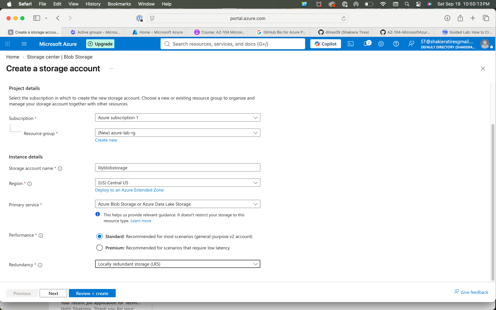
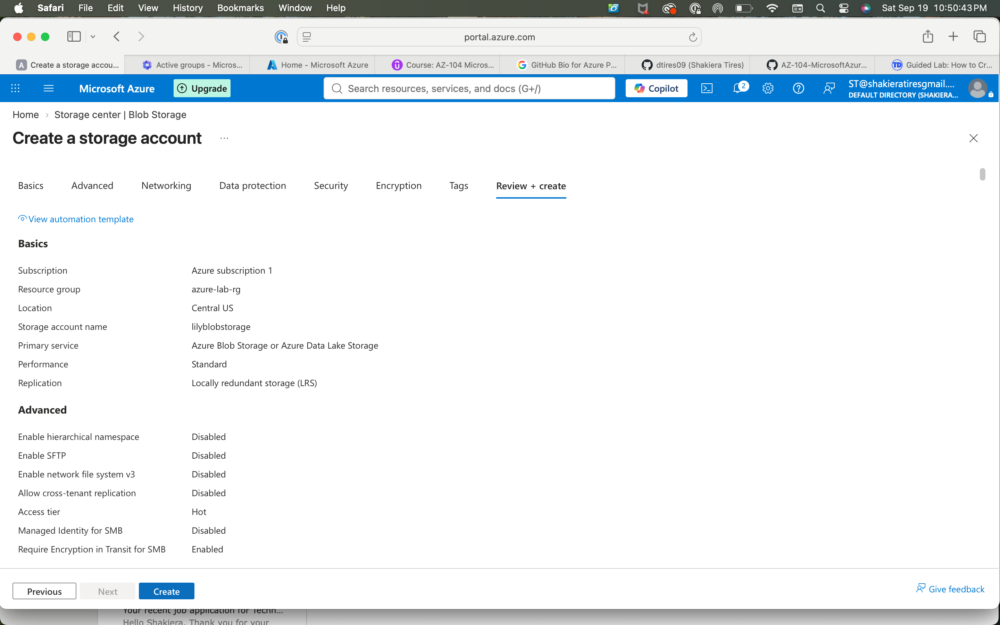
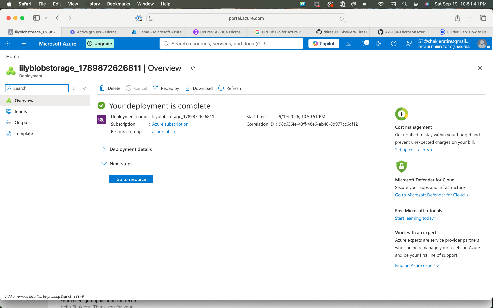
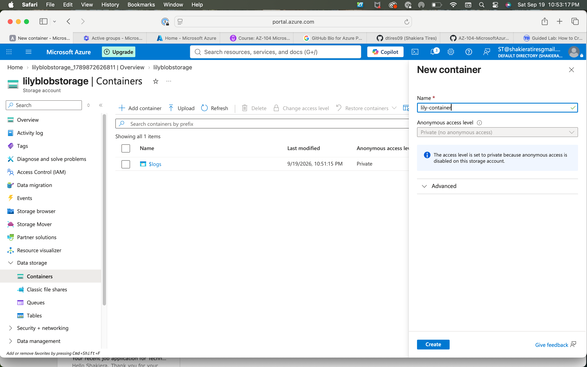
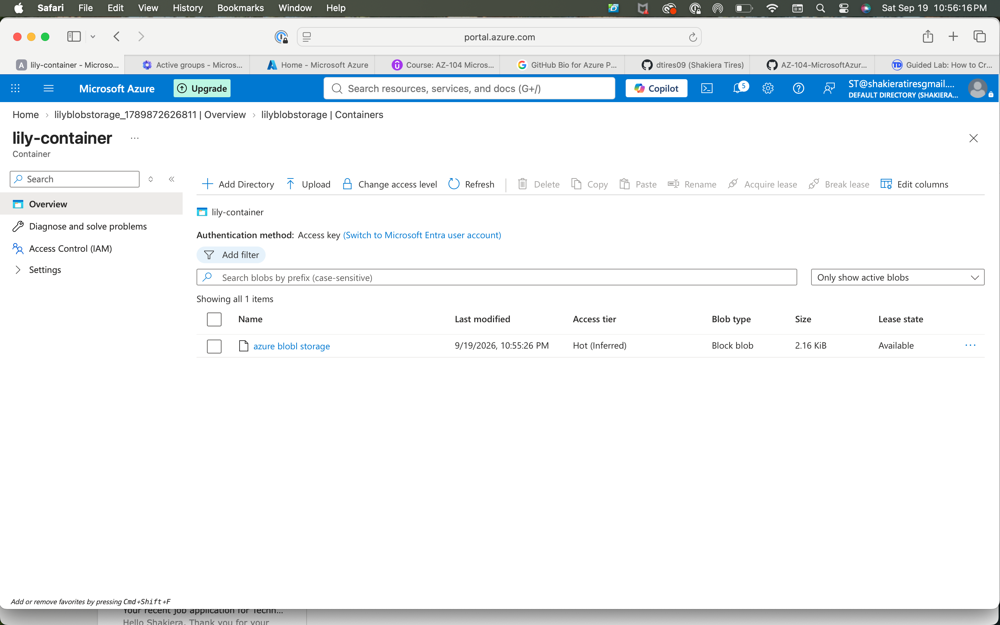

# Azure Blob Storage & Access Management Lab

## 🎯 Objective
Provisioned an Azure Storage Account, configured private blob containers, reviewed anonymous access level permissions, and successfully uploaded and verified test data.

## 🛠️ Tech Stack & Concepts
* **Cloud Platform:** Microsoft Azure
* **Storage Services:** Azure Blob Storage (General-purpose v2)
* **Replication & Tiering:** Locally Redundant Storage (LRS), Hot Access Tier
* **Security & Governance:** Container Access Levels, Private Anonymous Access Restrictions

---

## 📋 Implementation Walkthrough & Screenshots

### 1. Storage Account Configuration & Deployment
Configured a general-purpose v2 Azure Storage account (`lilyblobstorage`) within the `azure-lab-rg` resource group utilizing Locally Redundant Storage (LRS) and the Hot access tier.
* **Storage Account Instance Details Setup:**

* **Reviewing Configuration Prior to Provisioning:**

* **Successful Deployment Confirmation:**

### 2. Blob Container Creation & Access Level Review
Created a dedicated blob container (`lily-container`) and validated container access permissions, ensuring anonymous public access was disabled to adhere to security best practices.
* **Configuring New Container & Access Level:**

### 3. Data Ingestion & Blob Verification
Uploaded test sample data into the container and verified file properties, size, block type, and active lease status within the Azure Portal interface.
* **Uploaded Test Data in Blob Container:**

---

## 🚀 Key Takeaways
* Successfully deployed and configured a scalable cloud storage account and private container structure in Azure.
* Verified security settings surrounding anonymous access levels and confirmed proper upload execution of block blobs.